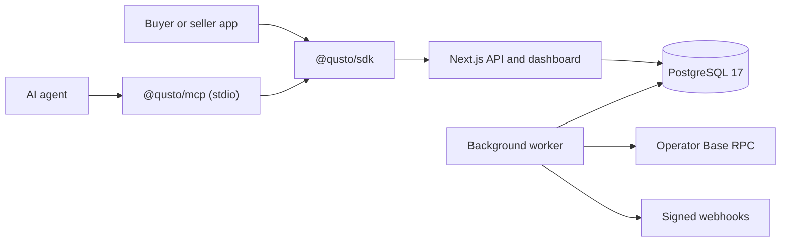

# Qusto architecture

The web service is the synchronous control plane. API-key authentication resolves a project environment, immutable active policy definitions are loaded, and monetary budget checks acquire per-scope PostgreSQL advisory locks. Allowed budgeted payments receive expiring reservations, which become settled ledger entries only after completion.

Telemetry is append-only and idempotent. `trace_events` stores the immutable lifecycle while `traces` is the dashboard projection. The ingestion transaction also inserts reconciliation and webhook jobs, so accepted events cannot be separated from their asynchronous work.

The worker claims jobs with `FOR UPDATE SKIP LOCKED`, retries failures with exponential backoff, signs webhook payloads using timestamped HMAC-SHA256, reconciles only known transaction hashes, maintains daily partitions, and updates its heartbeat. Published policy versions and audit records are immutable.

Trust boundaries:

- SDK applications own signing keys. Qusto receives payment context and lifecycle metadata, never the key.
- The MCP process may receive a local key, but only the local process uses it.
- Project API keys are lookup-prefix plus high-entropy secret and are stored as hashes.
- Webhook secrets are AES-256-GCM encrypted with `QUSTO_ENCRYPTION_KEY` and displayed once.
- Metadata passes through URL, header, payload allowlist, redaction, and 32 KiB limits before persistence.
